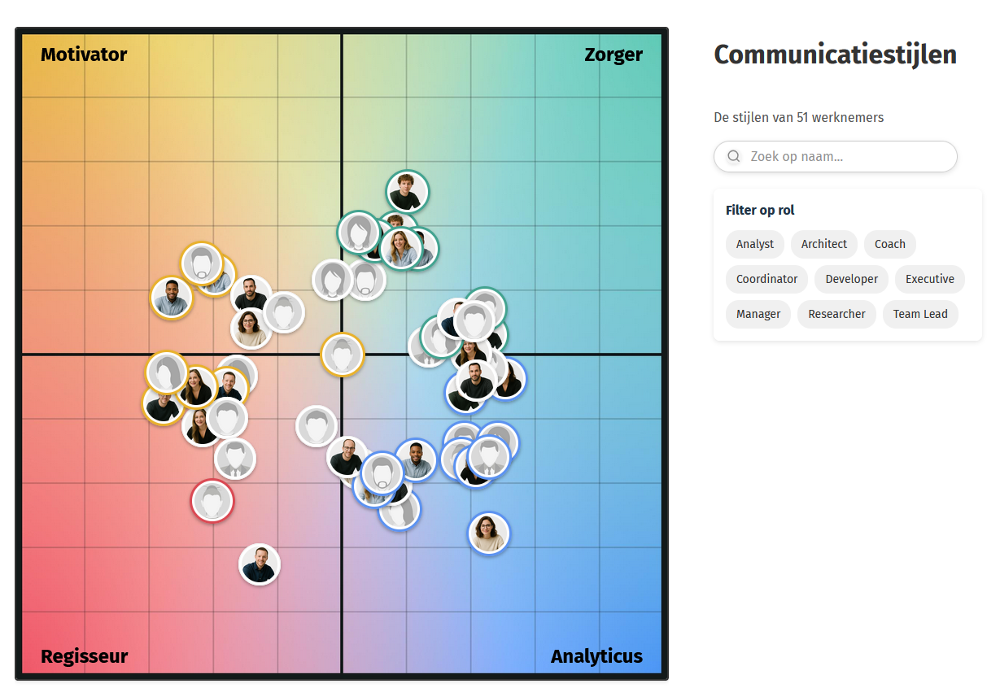

# DISC Personality Quadrant App

A React application that visualizes personality profiles using the DISC model, plotting individuals on a quadrant that represents different behavioral styles.



## About the Project

This application displays personality profiles based on the DISC model, which categorizes behavior into four main types:

- **D (Dominance/Regisseur)**: Direct and decisive, focuses on results
- **I (Influence/Motivator)**: Optimistic and outgoing, focuses on relationships
- **S (Steadiness/Zorger)**: Supportive and stable, focuses on cooperation
- **C (Conscientiousness/Analyticus)**: Careful and analytical, focuses on quality

The app plots people's personality profiles on a quadrant visualization based on their scores, allowing for easy visualization of behavioral tendencies and team dynamics.

## Features

- Interactive quadrant plot visualization
- CSV data import for personality profiles
- Support for profile photos
- Responsive layout
- Hover effects for detailed information

## Getting Started

These instructions will help you set up a copy of the project on your local machine for development and testing purposes.

### Prerequisites

- [Node.js](https://nodejs.org/) (version 18 or higher recommended)
- npm or yarn package manager

### Installation

1. Clone the repository
   ```bash
   git clone [repository-url]
   cd disc-app
   ```

2. Install dependencies
   ```bash
   npm install
   # or
   yarn
   ```

3. Start the development server
   ```bash
   npm run dev
   # or
   yarn dev
   ```

4. Open your browser and navigate to `http://localhost:5173`

## Project Structure

```
disc-app/
├── public/              # Static assets
│   ├── vite.svg         # Vite logo
│   ├── background.png   # Quadrant background image
│   ├── fotos/           # Profile photos
│   └── persoonlijkheden.csv  # Personality data
├── src/                 # Source code
│   ├── components/      # React components
│   │   ├── PlotBackground.tsx  # Background for the quadrant plot
│   │   ├── PlotControls.tsx    # Controls for the plot display
│   │   ├── PlotPoint.tsx       # Individual data points on the plot
│   │   └── QuadrantPlot.tsx    # Main plot component
│   ├── utils/           # Utility functions
│   │   └── plotUtils.ts # Utilities for plot calculations
│   ├── assets/          # Static assets for the app
│   ├── App.tsx          # Main application component
│   ├── App.css          # Main styles
│   ├── types.ts         # TypeScript type definitions
│   ├── index.css        # Global styles
│   └── main.tsx         # Application entry point
├── eslint.config.js     # ESLint configuration
├── tsconfig.json        # TypeScript configuration
├── tsconfig.app.json    # App-specific TypeScript config
├── tsconfig.node.json   # Node-specific TypeScript config
└── vite.config.ts       # Vite configuration
```

## Data Format

The application expects CSV data in the following format:

```csv
naam,plotx,ploty,foto
"Person Name",0.5,-0.3,"person-name"
```

- `naam`: The name of the person
- `plotx`: X-coordinate on the quadrant plot (-1 to 1)
- `ploty`: Y-coordinate on the quadrant plot (-1 to 1)
- `foto`: Optional filename of the person's photo (without extension, stored in public/fotos/)

## Customizing the App's Appearance

The app's appearance can be customized in various ways to match your design preferences. This section explains how to modify different aspects of the visualization.

### Component Customization

#### PlotPoint Component (Profile Circles)

The `PlotPoint.tsx` component controls how individual profiles appear on the plot:

```tsx
// In PlotPoint.tsx, find the contentStyle and pointStyle objects

// Photo appearance (contentStyle)
backgroundSize: '140%',     // Control zoom level of profile photos
backgroundPosition: '50% 10%',  // Focus on specific part of photo (horizontal% vertical%)

// Circle size and appearance (pointStyle)
width: isEnhanced ? '70px' : '50px',  // Size when normal vs. enhanced (hovered/focused)
height: isEnhanced ? '70px' : '50px',
borderRadius: '50%',  // Makes it circular
backgroundColor: 'white',  // Background color for the circle
boxShadow: isEnhanced ? '0px 3px 6px rgba(0,0,0,0.5)' : '0px 2px 3px rgba(0,0,0,0.3)',
border: getBorderStyle(),  // Border highlighting based on personality scores

// Animation settings
transition: 'all 0.2s ease-out',  // Controls animation speed and style
transform: `scale(${isVisible ? (isEnhanced ? 1.1 : 1) : 0.8})`,  // Scales point based on state
```

#### Popup Tooltip Customization

The popup tooltips that appear when hovering over profiles can be customized:

```tsx
// In PlotPoint.tsx, find the getPopupStyle function

// Base tooltip appearance
backgroundColor: 'white',
padding: '8px 12px',
borderRadius: '6px',
boxShadow: '0px 2px 4px rgba(0,0,0,0.2)',
fontSize: '18px',
fontWeight: 'normal',

transition: 'opacity 0.15s ease-out',

// Positioning - controlled by the popupPosition state variable
// The app automatically adjusts tooltip positions near screen edges
```

#### Personality Score Colors

The colors used for the four personality types can be customized:

```tsx
// In PlotPoint.tsx, look for color references in renderPersonalityScores
<span style={{ color: '#BD8A00' }}>Motivator:</span>  // Yellow/gold
<span style={{ color: '#16836B' }}>Zorger:</span>     // Green
<span style={{ color: '#D73C47' }}>Regisseur:</span>  // Red
<span style={{ color: '#2870EB' }}>Analyticus:</span> // Blue

// Border highlighting colors (in getBorderStyle function)
// These colors appear as borders when a score exceeds 18
borderColor = '#DA4953';  // Regisseur (red)
borderColor = '#e8b12d';  // Motivator (yellow)
borderColor = '#43A390';  // Zorger (green)
borderColor = '#5C92F0';  // Analyticus (blue)
```

### Background and Quadrant Plot

The `PlotBackground.tsx` component controls the plot's base appearance:

```tsx
// In PlotBackground.tsx
<svg 
  width={width} 
  height={height} 
  style={{ minWidth: '600px', border: '2px solid #333', borderRadius: '4px' }}
>
  {/* Background image */}
  <image href="/background.png" width={width} height={height} x="0" y="0" />

  {/* Quadrant labels */}
  <text 
    fontSize="24" 
    fontWeight="bold" 
    fill="black"
  >
    Motivator
  </text>
  // ...other labels
</svg>
```

To customize the plot:

1. **Background Image**: Replace the `/background.png` file with your own design (maintaining the same name or updating the reference in the code)
2. **Plot Dimensions**: Modify the `width` and `height` constants in `QuadrantPlot.tsx` (default is 800x800)
3. **Border**: Adjust the `border` and `borderRadius` properties in the SVG style
4. **Label Text & Appearance**: Change the text content, positioning, font size, and color of the quadrant labels

### Filtering and Search Components

The search bar and filter components can be styled by modifying the respective component files:

- `SearchBar.tsx`: Customize the appearance of the search input
- `RoleFilter.tsx`: Adjust the look of the role selection filters
- `FilterModeToggle.tsx`: Modify the appearance of the filter mode toggle

### Animation Settings

The app uses CSS transitions for animations. Key animation settings include:

1. **Profile Appearance/Disappearance**:
   ```tsx
   // In PlotPoint.tsx
   opacity: isVisible ? 1 : 0,
   transform: `scale(${isVisible ? (isEnhanced ? 1.1 : 1) : 0.8})`,
   transition: 'all 0.2s ease-out',
   ```

2. **Hover Effects**:
   The `isEnhanced` state (triggered on hover or when a point is the only search result) controls size, shadow, and z-index changes.

3. **Popup Animations**:
   ```tsx
   // In getPopupStyle function
   transition: 'opacity 0.15s ease-out',
   ```

### Responsive Design

The app uses relative positioning to ensure responsiveness:

```tsx
// In QuadrantPlot.tsx
<div ref={containerRef} style={{ overflow: 'auto', margin: '20px', position: 'relative' }}>
  {/* Plot components */}
</div>
```

The plot adjusts to container size changes and window resizing events with the effect hook that recalculates positions.

### Creating Custom Themes

To create a completely new theme for the application:

1. **Color Scheme**: Update the colors used for personality types and UI elements
2. **Background Image**: Design a new quadrant background with your desired style
3. **Component Styles**: Modify the CSS properties in the component style objects
4. **Typography**: Adjust font sizes, weights, and families throughout the components

### Advanced Customization

For more extensive changes:

1. **CSS Modules**: Consider moving inline styles to CSS modules for better organization
2. **Theme Provider**: Implement a theme provider context to manage colors and styles globally
3. **Configuration File**: Create a central configuration file with customizable parameters for easy adjustments

## Building for Production

To build the application for production:

```bash
npm run build
# or
yarn build
```

The built files will be in the `dist` directory and can be served using any static file server.

## Deployment

To preview the production build locally:

```bash
npm run preview
# or
yarn preview
```

## Built With

- [React](https://reactjs.org/) - UI framework
- [TypeScript](https://www.typescriptlang.org/) - Type-safe JavaScript
- [Vite](https://vitejs.dev/) - Frontend tooling
- [Papa Parse](https://www.papaparse.com/) - CSV parsing library

## Docker Setup

This application includes Docker support for easy deployment in any environment.

### Prerequisites

- [Docker](https://www.docker.com/get-started) installed on your system
- [Docker Compose](https://docs.docker.com/compose/install/) (usually included with Docker Desktop)

### Running with Docker

1. Build and start the container:
   ```bash
   docker compose up -d
   ```

2. Access the application in your browser:
   ```
   http://localhost:8080
   ```

3. Stop the container:
   ```bash
   docker compose down
   ```

### Docker Implementation Details

The application uses a multi-stage Docker build for efficiency:

- **Build Stage**: Uses Node Alpine to build the application
- **Production Stage**: Uses NGINX Alpine to serve the static files
- Port 8080 on the host is mapped to port 80 in the container

### Customizing the Docker Setup

- To change the port mapping, edit the `ports` section in `docker-compose.yml`:
  ```yaml
  ports:
    - "YOUR_PORT:80"
  ```

- To rebuild after code changes:
  ```bash
  docker compose up -d --build
  ```

## To do
- ~~Modify font to use Fira Sans everywhere~~
- ~~Show the (newly added) numbers corresponding to the types in the popup~~
- ~~If one of the numbers is larger than 18, color the border of the image in the corresponding color~~
- ~~Search functionality to find a person by name and highlight them in the plot somehow~~
- ~~Remove sliders for the collision algorithm~~
- Fix bug where zooming in beyond the size of the screen starts breaking link between the background and the plotted images. 
- ~~Collision avoidance is acting weird; 25 seems about right but needs 50 iterations and 20 seems to do nothing.~~ 
- ~~fix colors to have colors that work well on white background etc~~
- ~~Add a filter where you can filter on job type~~
- ~~Put title, searchbar and filter on the right side of the plot, to reduce need for scrolling on certain resolutions~~
- ~~The plot disappears when no search results are found.~~
- ~~When I search, I would like to hover over people and make their popup come in front of the others.~~
- ~~The pop-up animation is a little bit jittery, can we fix this?~~
- ~~merge changes paul in main~~
- ~~make into a docker container for easier deployment~~
- ~~people that are close to the edge have their pop-up boxes clipped by the edge of the plot~~
- ~~when finding someone via search, their image doesn't pop up~~
- ~~show list of names found by the search bar to make searching easier. ~~
- ~~further refactor code~~
- ~~Search functionality works a little bit weird now. Only person that remains visible is the one that has matching first letter.~~ 

## License

This project is licensed under the MIT License - see the LICENSE file for details.

## Acknowledgments

- DISC personality assessment model
- This is an anonymized demo version of the app
